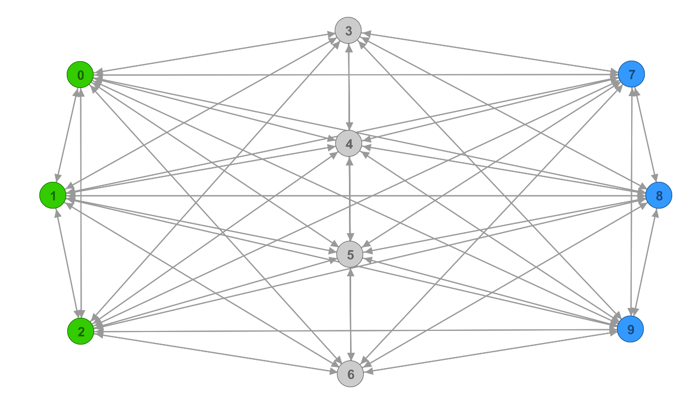
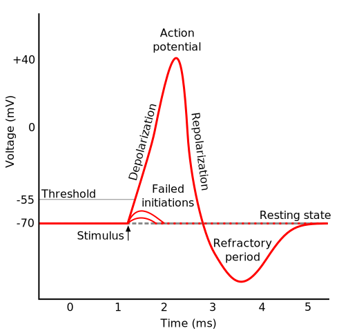

# Brainy

A small spiking neural network (SNN) that can learn to recognize and memorize patterns and execute simple operations such as XOR. It is trained using two different neuro-evolution algorithms.

## Neural Network
### Structure

The artificial neural network (ANN) consists of neurons (nodes) and axons (edges) that connect the neurons with each other. At large, the ANN is a fully connected directed graph such as the one depicted above. There are three dedicated input neurons (green) and three dedicated output neurons (blue). The input neurons receive the input activations while the calculated output is read from the output neurons. Apart from that, there is no difference among the neurons and any number of neurons may be used to solve more complex tasks. Self-loops (edges from nodes to themselves) decreased the performance in some tasks and are thus not allowed.

### Neuron

[1]

The artificial neuron modelled in this project is loosely based on its biological counterpart. In particular, it follows the neuronal dynamics of the intergrate-and-fire model where incoming voltage spikes are summed up (integrated) over time until a certain threshold is reached within the neuron. Upon reaching the threshold, the neuron emits (fires) an electrical signal which is always equal to the full action potential and not dependent on the input signals. During a period of time after firing (the refractory period), the action potential within the neuron is being restored and the neuron is incapable of emitting additional signals in the process. Any incoming signals are ignored during this period. The graph above illustrates a simplified version of this process in a biological neuron. In the artificial neuron however, the process is even further simplified. For example, the artificial neuron releases the action potential instanenously and thus there is no depolarization phase after the threshold is reached. Failed initiations cannot happen because incoming signals are always summed up and never decreased over time.

The artificial neuron has the following properties

-  **Activation threshold: 0.2mV**
-  **Refractory period: 10ms**
-  **Potential floor: -0.2mV**
-  **Starting potential: 0.0mV**

The activation threshold is the voltage sum that needs to be reached for the neuron to fire and release its action potential. A neuron that fires releases the full action potential equal to 1. Because axons can both excite and inhibit the neuron (they can add negative and positive values to the voltage sum) the neuron has a potential floor that serves as a lower bound for the sum. Initially, the neuron starts in a neutral state of 0.0mV. The voltages defined above do not agree with signals measured in biological cells, they are instead chosen for numerical stability and to balance the number of generated spikes. 

### Axon
An axon connects two neurons with each other. When a signal travels on the axon it is multiplied by the axon's weight. In addition, the axon's length determines the time it takes to travel to the destination neuron. Both of these paramaters are trainable and determine the behaviour of the network.

-  **Length or activation delay (trainable parameter) : [0,1]**
-  **Weight or signal multiplicator (trainable parameter) : [-1,1]**

An axon with a length of 1.0 takes 100ms to traverse.

## Input/Output
The input to the network is an arbitrary length sequence of bits while the output is a sequence of integers. In every interval of 100ms, the next three input bits are fed into the three input neurons. Temporal encoding is used, meaning that for each 1 in the input sequence the corresponding input neuron is activated once, while for each 0 nothing is done. The output neurons record for each interval the number of times they were activated and hence the output is a sequence of integers.

For example, consider the following input

*110 001 001 111 000 011 000 111 011 100 101 110 111 101 ...*

In the first interval, input neuron 0 and 1 are activated while input neuron 3 is not activated. In the next interval, input neuron 3 is activated.
The output could for example be

*000 000 110 001 001 111 000 011 000 111 011 313 201 110 411 101 ...*

if the network was trained to shift the output sequence 6 steps into the future but failed to achieve 100% accuracy.

## Neuro-evolution

### Algorithm

The network can be trained with a neuroevolution algorithm similar to the one described [here](https://arxiv.org/pdf/1712.06567.pdf). 

There is a population of 20 individuals where each individual has its own set of randomly initialized parameters (the weights and lengths of axons). Each individual's fitness is measured by feeding it the same input and comparing the generated output to the groundtruth. The individuals are then sorted by their performance (accuracy) on this task. The top 5 fittest individuals become the parents for the new generation. The 5 parents' parameters are randomly perturbed using samples from a gaussian distribution (and multiplied by some factor to regulate mutation speed) to create 19 new individuals. In addition, the best performing parameters are kept as they are and added again to the population to give a total of 20 individuals. This process repeats until the required accuracy is achieved or the networks no longer improve. Each iteration of the algorithm is called a generation.

## Experiments
*Note: For the purpose of minimizing variance in the experiments the network weights and axon lengths have been initialized with a fixed value of 0.01 and 1.0 respectively. The gaussian noise is multiplied by 0.01.* 

### Identity
The goal of the identity experiment is to see whether a randomly generated binary input sequence can be accurately reproduced as output with a fixed number of delay. The input of 400 bits is fed continuously into the network while the output is generated. This forces the network to temporarily memorize and buffer the input, while also learning to synchronize the output into the 100ms intervals. The experiments are repeated 10 times and then averaged, and the task was considered solved when the best performing individual achieved at least 99% accuracy. In cases where not all 10 test runs reached the required accuracy the best result is listed. The number of spikes is the total number of neuron firings of the best individual on the last input sample.

#### Results for 0 timestep delay 
| # main neurons     | # generations | # spikes | 
| ----------- | ----------- | ----------- |
|    1   | 47  | 1306 |
|    2   | 48 | 1345 |
|    4   | 51  | 1406 |
|    8   | 57 | 1531 |
|    16  | 101 | 1711 |

#### Result for 1 timestep delay
| # neurons      | # generations  | # spikes | 
| ----------- | ----------- | ----------- |
|    1   |   > 125     |   1456  |
|    2   |   > 75     |   1332  |
|    4   |   > 77    |   1463  |
|    8   |   117   |   1824  |
|    16  |   245  |   2201  |

#### Result for 3 timesteps delay
| # neurons      | # generations  | # spikes | 
| ----------- | ----------- | ----------- |
|    1   |   ∞     |   ?  |
|    2   |   > 794   |   1858  |
|    4   |   > 327    |   2015  |
|    8   |   > 175  |   1984  |
|    16  |   > 326 |   2274  |

#### Result for 9 timesteps delay
| # neurons      | # generations  | # spikes |  maximum accuracy | 
| ----------- | ----------- | ----------- | ----------- |
|    1   |   ∞     |   ?  |   73.9%  |
|    2   |   ∞   |   ?  |   75.1%  |
|    4   |   ∞    |   ?  |   83.4%  |
|    8   |   ∞  |   ?  |   85.3%  |
|    16  |   ∞ |   ?  |   93.3%  |

### Memorization
**TODO**

### XOR Operator
**TODO**

## Curriculum learning
**TODO**

## References
<a id="1">[1]</a> 
https://commons.wikimedia.org/wiki/File:Action_potential.svg

<a id="2">[2]</a> 
Such, Felipe and Madhavan, Vashisht and Conti, Edoardo and Lehman, Joel and Stanley, Kenneth and Clune, Jeff (2017). 
Deep Neuroevolution: Genetic Algorithms Are a Competitive Alternative for Training Deep Neural Networks for Reinforcement Learning.
